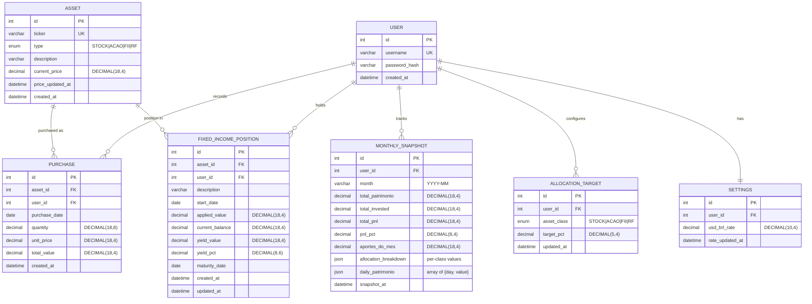

# feat: Investment Portfolio Management Fullstack App

## Overview

Build a fullstack investment portfolio management app that replaces an Excel spreadsheet. The app manages 73 assets across 4 classes (30 US Stocks, 30 BR Stocks, 10 FIIs, 3 RF types) with live price updates, rebalancing engine, and a dark-themed dashboard.

**Tech Stack:** FastAPI (Python) + Next.js (App Router) + MySQL + Docker Compose

**Key flows:** Monthly dashboard with `< Mes/Ano >` navigation (like Securo), portfolio drill-down by asset class, purchase recording, asset catalog management, on-demand price updates (cached), editable allocation targets with gap-based rebalancing, and one-time Excel import.

(see brainstorm: `docs/brainstorms/2026-03-18-carteira-investimentos-app-brainstorm.md`)

## Problem Statement / Motivation

The current Excel spreadsheet works but lacks:
- **Live price updates** - prices are manually entered
- **Easy asset management** - adding/removing assets requires editing formulas
- **Mobile-friendly access** - Excel is desktop-only
- **Polished UI** - spreadsheet aesthetics vs dark dashboard
- **Data integrity** - no validation, easy to break formulas

## Proposed Solution

A two-section web app:

1. **Carteira (Portfolio)** - 6 subpages: Overview, Stocks (EUA), Acoes (Brasil), FIIs, Renda Fixa, Historico de Aportes
2. **Ativos Desejados (Desired Assets / Rebalancing)** - Editable allocation targets, monthly contribution input, gap analysis, investment plan

With simple JWT auth (single user), on-demand price fetching (yfinance for US, brapi.dev for BR), and initial data seeded from the existing Excel file.

## Technical Approach

### Architecture

```
┌─────────────────────┐     ┌──────────────────────┐     ┌─────────┐
│   Next.js Frontend  │────▶│   FastAPI Backend     │────▶│  MySQL  │
│   (Port 3000)       │     │   (Port 8000)         │     │  (3306) │
│                     │     │                       │     │         │
│  App Router         │     │  /api/auth            │     │ assets  │
│  Server Components  │     │  /api/assets          │     │ purchase│
│  Tailwind CSS       │     │  /api/purchases       │     │ rf_pos  │
│  Dark Theme         │     │  /api/portfolio       │     │ targets │
│                     │     │  /api/prices          │     │ settings│
│                     │     │  /api/rebalancing     │     │         │
└─────────────────────┘     │  /api/fixed-income    │     └─────────┘
                            │  /api/allocation      │
                            │                       │
                            │  Services:            │
                            │  - PriceService       │──▶ yfinance / brapi.dev
                            │  - RebalancingService │
                            │  - ImportService      │
                            └───────────────────────┘
```

### Project Structure

```
financial_system/
├── docker-compose.yml
├── .env.example
├── .gitignore
│
├── backend/
│   ├── Dockerfile
│   ├── requirements.txt
│   ├── alembic.ini
│   ├── alembic/
│   │   └── versions/
│   ├── app/
│   │   ├── main.py                 # FastAPI app entry, CORS, lifespan
│   │   ├── config.py               # Settings via pydantic-settings
│   │   ├── database.py             # Async SQLAlchemy engine + session
│   │   ├── dependencies.py         # get_db, get_current_user
│   │   ├── models/
│   │   │   ├── user.py
│   │   │   ├── asset.py
│   │   │   ├── purchase.py
│   │   │   ├── fixed_income.py
│   │   │   ├── allocation_target.py
│   │   │   ├── monthly_snapshot.py
│   │   │   └── settings.py
│   │   ├── schemas/
│   │   │   ├── auth.py
│   │   │   ├── asset.py
│   │   │   ├── purchase.py
│   │   │   ├── fixed_income.py
│   │   │   ├── portfolio.py
│   │   │   ├── allocation.py
│   │   │   └── rebalancing.py
│   │   ├── routers/
│   │   │   ├── auth.py
│   │   │   ├── assets.py
│   │   │   ├── purchases.py
│   │   │   ├── fixed_income.py
│   │   │   ├── portfolio.py
│   │   │   ├── prices.py
│   │   │   ├── allocation.py
│   │   │   └── rebalancing.py
│   │   └── services/
│   │       ├── auth_service.py
│   │       ├── price_service.py    # yfinance + brapi integration
│   │       ├── rebalancing_service.py
│   │       └── import_service.py   # Excel import
│   └── scripts/
│       ├── seed_user.py
│       └── import_excel.py
│
├── frontend/
│   ├── Dockerfile
│   ├── package.json
│   ├── tailwind.config.ts
│   ├── next.config.ts
│   ├── src/
│   │   ├── app/
│   │   │   ├── layout.tsx          # Root layout, sidebar, dark theme
│   │   │   ├── page.tsx            # Redirect to /carteira
│   │   │   ├── login/
│   │   │   │   └── page.tsx
│   │   │   ├── carteira/
│   │   │   │   ├── layout.tsx      # Carteira sub-navigation
│   │   │   │   ├── page.tsx        # Overview
│   │   │   │   ├── stocks/
│   │   │   │   │   └── page.tsx
│   │   │   │   ├── acoes/
│   │   │   │   │   └── page.tsx
│   │   │   │   ├── fiis/
│   │   │   │   │   └── page.tsx
│   │   │   │   ├── renda-fixa/
│   │   │   │   │   └── page.tsx
│   │   │   │   └── aportes/
│   │   │   │       └── page.tsx
│   │   │   └── desejados/
│   │   │       └── page.tsx        # Rebalancing + asset catalog
│   │   ├── components/
│   │   │   ├── ui/                 # Shared UI (Card, Table, Button, Modal, ProgressBar)
│   │   │   ├── sidebar.tsx
│   │   │   ├── month-navigator.tsx # < Mes/Ano > arrows navigation
│   │   │   ├── summary-cards.tsx
│   │   │   ├── allocation-breakdown.tsx  # Per-class progress bars
│   │   │   ├── patrimonio-chart.tsx      # Monthly line chart
│   │   │   ├── month-transactions.tsx    # Purchases in selected month
│   │   │   ├── positions-table.tsx
│   │   │   ├── purchase-form.tsx
│   │   │   ├── asset-form.tsx
│   │   │   ├── rebalancing-plan.tsx
│   │   │   └── price-update-button.tsx
│   │   ├── lib/
│   │   │   ├── api.ts              # Fetch wrapper with JWT
│   │   │   ├── auth.ts             # Auth context + token management
│   │   │   └── format.ts           # Currency formatting (R$, $)
│   │   └── types/
│   │       └── index.ts            # TypeScript interfaces
│   └── public/
│
├── scripts/
│   └── import_excel.py             # One-time import script
│
└── docs/
    ├── brainstorms/
    └── plans/
```

### Database Schema



**Key design decisions:**
- `DECIMAL(18,4)` for prices/values, `DECIMAL(18,8)` for quantities (fractional shares), `DECIMAL(8,6)` for percentages
- Position (qty, avg price, P&L) is **computed at query time** from purchases, not stored separately - simpler, always consistent
- No `Position` table - avoids sync issues. Aggregate query: `SELECT asset_id, SUM(quantity), SUM(total_value), SUM(total_value)/SUM(quantity) FROM purchases GROUP BY asset_id`
- Purchases are append-only but **can be edited/deleted** (user may fix typos). Soft-delete not needed for single user.
- BRL is the **base currency**. US stock prices stored in BRL (converted at `usd_brl_rate` from Settings). This matches the spreadsheet behavior.
- No sales/disposals in v1. Portfolio is buy-only. Can be added later as negative-quantity purchases.
- **MonthlySnapshot** table stores end-of-month portfolio state (patrimonio, allocation, daily evolution). Current month is computed live. Past months are snapshotted (frozen) and read from the table for performance and historical accuracy. A snapshot is generated automatically when the user navigates to a past month for the first time, or via a "close month" action.

### Implementation Phases

#### Phase 1: Foundation (Backend + Database)

**Goal:** Working API with all endpoints, database schema, and auth.

**Tasks:**

1. **Project scaffolding**
   - `docker-compose.yml` with MySQL 8.0, FastAPI, Next.js services
   - `backend/Dockerfile`, `frontend/Dockerfile`
   - `.env.example` with all config vars
   - `.gitignore` (Python, Node, .env, mysql data)
   - Initialize git repo

2. **Database setup** (`backend/app/database.py`, `backend/app/models/`)
   - Async SQLAlchemy 2.0 with `aiomysql`
   - All 7 models (User, Asset, Purchase, FixedIncomePosition, AllocationTarget, Settings, MonthlySnapshot)
   - Alembic migration for initial schema
   - `backend/app/config.py` - pydantic-settings for `DATABASE_URL`, `SECRET_KEY`, `JWT_ALGORITHM`, `JWT_EXPIRATION`

3. **Auth** (`backend/app/routers/auth.py`, `backend/app/services/auth_service.py`)
   - `POST /api/auth/login` - returns JWT token (access + refresh)
   - `POST /api/auth/refresh` - silent token refresh
   - `backend/app/dependencies.py` - `get_current_user` dependency
   - Password hashing with `passlib[bcrypt]`
   - JWT via `python-jose[cryptography]`
   - `backend/scripts/seed_user.py` - creates user from env vars (`ADMIN_USERNAME`, `ADMIN_PASSWORD`)

4. **Asset CRUD** (`backend/app/routers/assets.py`)
   - `GET /api/assets` - list all assets, filterable by type
   - `GET /api/assets/{id}` - single asset
   - `POST /api/assets` - create asset (ticker, type, description). Auto-fetches price.
   - `PUT /api/assets/{id}` - edit asset metadata
   - `DELETE /api/assets/{id}` - delete asset. Returns 409 if has purchases.

5. **Purchase CRUD** (`backend/app/routers/purchases.py`)
   - `GET /api/purchases` - list purchases, filterable by asset_id, date range, type
   - `POST /api/purchases` - record new purchase (asset_id, date, qty, unit_price). Computes total_value.
   - `PUT /api/purchases/{id}` - edit purchase
   - `DELETE /api/purchases/{id}` - delete purchase

6. **Fixed Income** (`backend/app/routers/fixed_income.py`)
   - `GET /api/fixed-income` - list RF positions
   - `POST /api/fixed-income` - create position
   - `PUT /api/fixed-income/{id}` - update balance/yield
   - `DELETE /api/fixed-income/{id}` - remove position

7. **Portfolio aggregation** (`backend/app/routers/portfolio.py`)
   - `GET /api/portfolio/overview?month=2026-03` - **Monthly dashboard endpoint.** Returns:
     - `patrimonio_total` - total portfolio value at end of month
     - `total_invested` - cumulative invested amount up to that month
     - `aportes_do_mes` - sum of purchases made during the month
     - `variacao_mes` - P&L change during the month (R$ and %)
     - `allocation_breakdown` - per-class: {class, value, pct, target_pct, gap}
     - `daily_patrimonio` - array of {day, value} for line chart (patrimonio evolution over days of the month)
     - `transactions` - list of purchases made in the month (date, ticker, type, qty, price, total)
   - **Current month** (`month` = current or omitted): computed live from current asset prices and purchases
   - **Past months**: read from `MonthlySnapshot` table if exists. If not, computed from historical data (purchases up to end of that month + asset prices at that time). Past month snapshots use prices cached at `price_updated_at` closest to month end.
   - `GET /api/portfolio/{asset_class}` - positions for one class (ticker, qty, avg_price, current_price, market_value, pnl, pnl_pct)
   - Position computed from: `SELECT asset_id, SUM(quantity) as qty, SUM(total_value) as cost, SUM(total_value)/SUM(quantity) as avg_price FROM purchases WHERE asset_id IN (...) GROUP BY asset_id`

8. **Allocation targets** (`backend/app/routers/allocation.py`)
   - `GET /api/allocation-targets` - list targets
   - `PUT /api/allocation-targets` - update all targets (validates sum = 100%)

9. **Price service** (`backend/app/services/price_service.py`)
   - `POST /api/prices/update` - fetches all asset prices, updates `asset.current_price` and `asset.price_updated_at`
   - US Stocks: `yfinance` with `yf.download(tickers, period="1d")` for batch fetching. Convert USD to BRL using `usd_brl_rate`.
   - BR Stocks + FIIs: `brapi.dev` API with batch endpoint (`/api/quote/TICKER1,TICKER2,...`)
   - USD/BRL rate: fetched via yfinance (`USDBRL=X`)
   - Returns per-asset status (success/fail/cached)
   - Rate limiting: 2s delay between yfinance batches, batch of 10 tickers max

10. **Rebalancing engine** (`backend/app/services/rebalancing_service.py`, `backend/app/routers/rebalancing.py`)
    - `GET /api/rebalancing?contribution=50000&top_n=10`
    - Algorithm (matching spreadsheet logic):
      1. Compute `patrimonio_pos_aporte = current_total + contribution`
      2. For each class: `valor_alvo = patrimonio_pos_aporte * target_pct`
      3. For each class: `gap = valor_alvo - valor_atual`
      4. Distribute `contribution` proportionally to positive gaps
      5. Within each class: equal-weight across all assets (matching spreadsheet's approach)
      6. Sort by gap descending, return top N with calculated amounts
    - Returns: per-class breakdown + per-asset investment amounts (R$ and USD for stocks)

**Files created in Phase 1:**
- `docker-compose.yml`
- `.env.example`, `.gitignore`
- `backend/Dockerfile`, `backend/requirements.txt`, `backend/alembic.ini`
- `backend/app/main.py`, `backend/app/config.py`, `backend/app/database.py`, `backend/app/dependencies.py`
- `backend/app/models/*.py` (6 files)
- `backend/app/schemas/*.py` (7 files)
- `backend/app/routers/*.py` (8 files)
- `backend/app/services/*.py` (3 files)
- `backend/scripts/seed_user.py`
- `backend/alembic/env.py`, initial migration

#### Phase 2: Data Import

**Goal:** Import all existing data from the Excel spreadsheet into the database.

**Tasks:**

1. **Import script** (`scripts/import_excel.py`)
   - Uses `openpyxl` to read `carteira_investimentos (8).xlsx`
   - Imports in order: Assets (from `Ativos` sheet) → Purchases (from `Aportes` sheet) → RF Positions (from `Renda Fixa` sheet) → Allocation Targets (from `Alocacao` sheet) → Settings (USD/BRL from `Posicao` sheet)
   - **Excel schema mapping:**
     - `Ativos` sheet: rows 6-35 (Stocks), 39-68 (Acoes), 72-81 (FIIs), 85-87 (RF) → `Asset` table
     - `Aportes` sheet: rows 5+ (Date, Ticker, Type, Qty, UnitPrice, TotalValue) → `Purchase` table
     - `Renda Fixa` sheet: rows 6+ (Date, Type, Description, Applied, Balance, Yield, YieldPct, Maturity) → `FixedIncomePosition` table
     - `Alocacao` sheet: rows 7-10 (Class, %, Qty) → `AllocationTarget` table
     - `Posicao` sheet: cell C2 (USD/BRL rate) → `Settings` table
   - Validates data before insert (required fields, numeric types, date formats)
   - Skips rows with all-null values
   - Prints summary: "Imported X assets, Y purchases, Z RF positions, allocation targets set"
   - Idempotent: can be re-run (upserts by ticker for assets, skips duplicate purchases by date+ticker+qty)

**Files created in Phase 2:**
- `scripts/import_excel.py`

#### Phase 3: Frontend - Layout & Auth

**Goal:** Next.js app with dark-themed layout, sidebar, login flow, and auth context.

**Tasks:**

1. **Next.js scaffolding** (`frontend/`)
   - `npx create-next-app@latest` with App Router, TypeScript, Tailwind CSS, ESLint
   - Configure `next.config.ts` for API proxy to backend (`rewrites` to `http://localhost:8000`)
   - Tailwind config: dark theme colors matching Securo reference

2. **Color palette and design tokens** (derived from reference image)
   ```
   Background:    #0f1117 (main), #1a1d27 (sidebar), #1e2130 (cards)
   Borders:       #2a2d3a
   Text:          #f8fafc (primary), #94a3b8 (secondary), #64748b (muted)
   Accent:        #3b82f6 (blue links), #10b981 (green/positive), #ef4444 (red/negative)
   Yellow/Warning: #f59e0b
   ```

3. **Root layout** (`src/app/layout.tsx`)
   - Dark background, Inter font
   - Sidebar component with navigation icons
   - Auth provider wrapping all routes
   - Redirect to `/login` if not authenticated

4. **Sidebar** (`src/components/sidebar.tsx`)
   - Logo/app name at top
   - Nav items: Painel (overview), Carteira (with sub-items), Ativos Desejados
   - Active state highlighting
   - Icons for each nav item (use Lucide React)

5. **Login page** (`src/app/login/page.tsx`)
   - Simple form: username + password
   - Calls `POST /api/auth/login`, stores JWT in httpOnly cookie or localStorage
   - Redirects to `/carteira` on success

6. **Auth context** (`src/lib/auth.ts`)
   - React context for auth state
   - Token stored in localStorage (single user, acceptable tradeoff)
   - Auto-refresh before expiration
   - Logout clears token + redirects to login

7. **API client** (`src/lib/api.ts`)
   - Fetch wrapper that adds `Authorization: Bearer <token>` header
   - Auto-redirect to login on 401
   - Base URL from env var

8. **Utility: currency formatting** (`src/lib/format.ts`)
   - `formatBRL(value)` → `R$ 10.903,21`
   - `formatUSD(value)` → `$ 949.97`
   - `formatPercent(value)` → `+2.35%` (green) or `-1.20%` (red)

**Files created in Phase 3:**
- `frontend/package.json`, `frontend/Dockerfile`, `frontend/tailwind.config.ts`, `frontend/next.config.ts`
- `src/app/layout.tsx`, `src/app/page.tsx`
- `src/app/login/page.tsx`
- `src/components/sidebar.tsx`
- `src/components/ui/card.tsx`, `button.tsx`, `table.tsx`, `modal.tsx`, `progress-bar.tsx`, `input.tsx`
- `src/lib/api.ts`, `src/lib/auth.ts`, `src/lib/format.ts`
- `src/types/index.ts`

#### Phase 4: Frontend - Carteira Pages

**Goal:** All 6 portfolio subpages with real data.

**Tasks:**

1. **Carteira layout** (`src/app/carteira/layout.tsx`)
   - Sub-navigation tabs: Overview | Stocks | Acoes | FIIs | Renda Fixa | Aportes

2. **Overview / Monthly Dashboard page** (`src/app/carteira/page.tsx`)
   - **Month navigation bar** at the top: `< Marco de 2026 >` arrows to navigate months (like Securo reference). URL query param `?month=2026-03`.
   - Server component fetches `/api/portfolio/overview?month=YYYY-MM`
   - **Summary cards row:** Total Patrimonio, Aportes do Mes, Variacao do Mes (R$ and % with green/red), Alocacao vs Meta status
   - **Allocation by class section:** Per-class breakdown with progress bars showing current % vs target % (like Securo's "Gastos por Categoria" but for asset classes: Stocks, Acoes, FIIs, RF). Each row: class icon, class name, current value (R$), percentage badge, progress bar against target.
   - **Patrimonio evolution chart:** Line chart showing daily portfolio value over the month (like Securo's "Fluxo de Saldo"). Use `recharts`. X-axis: days (1-31), Y-axis: R$ value. Green line for current month, dashed for previous month comparison.
   - **Transactions of the period:** List of purchases made in the selected month. Each row: asset icon/type badge, ticker + description, date, value (R$ with +/- color). Similar to Securo's "Transacoes do Periodo".
   - **"Atualizar Cotacoes" button** (client component, only visible for current month) - calls `/api/prices/update`, shows progress

3. **Positions table component** (`src/components/positions-table.tsx`)
   - Reusable for Stocks, Acoes, FIIs pages
   - Columns: Ticker, Description, Qty, Avg Price (R$), Current Price (R$), Market Value (R$), P&L (R$), P&L (%)
   - Green/red coloring for P&L
   - Subtotal row at bottom
   - Sort by any column (client-side)

4. **Stocks page** (`src/app/carteira/stocks/page.tsx`)
   - Fetches `/api/portfolio/STOCK`
   - Renders `PositionsTable`
   - Shows USD/BRL rate used

5. **Acoes page** (`src/app/carteira/acoes/page.tsx`)
   - Fetches `/api/portfolio/ACAO`
   - Renders `PositionsTable`

6. **FIIs page** (`src/app/carteira/fiis/page.tsx`)
   - Fetches `/api/portfolio/FII`
   - Renders `PositionsTable`

7. **Renda Fixa page** (`src/app/carteira/renda-fixa/page.tsx`)
   - Fetches `/api/fixed-income`
   - Custom table: Description, Type, Applied Value, Current Balance, Yield (R$), Yield (%), Maturity Date
   - Totals row
   - Add/Edit/Delete RF positions via modal

8. **Aportes page** (`src/app/carteira/aportes/page.tsx`)
   - Fetches `/api/purchases`
   - Table: Date, Ticker, Type, Qty, Unit Price, Total Value
   - Filters: date range picker, asset type dropdown, ticker search
   - "Registrar Aporte" button → opens `PurchaseForm` modal
   - Edit/Delete actions per row

9. **Purchase form modal** (`src/components/purchase-form.tsx`)
   - Client component
   - Fields: Asset (autocomplete search by ticker/name), Date, Quantity, Unit Price (auto-filled from cached price)
   - Computed: Total Value = Qty × Unit Price
   - Submit calls `POST /api/purchases`

**Files created in Phase 4:**
- `src/app/carteira/layout.tsx`, `src/app/carteira/page.tsx`
- `src/app/carteira/stocks/page.tsx`, `acoes/page.tsx`, `fiis/page.tsx`, `renda-fixa/page.tsx`, `aportes/page.tsx`
- `src/components/month-navigator.tsx` - `< Mes/Ano >` arrows with current month display
- `src/components/positions-table.tsx`, `summary-cards.tsx`
- `src/components/allocation-breakdown.tsx` - per-class progress bars (current vs target)
- `src/components/patrimonio-chart.tsx` - line chart for daily patrimonio evolution
- `src/components/month-transactions.tsx` - list of purchases in the selected month
- `src/components/purchase-form.tsx`, `price-update-button.tsx`

#### Phase 5: Frontend - Desired Assets & Rebalancing

**Goal:** Asset catalog management and rebalancing page.

**Tasks:**

1. **Desired Assets page** (`src/app/desejados/page.tsx`)
   - **Section 1: Allocation Targets**
     - Editable % inputs for each class (Stock, Acao, FII, RF)
     - Validation: must sum to 100%
     - Save button → `PUT /api/allocation-targets`
     - Visual: horizontal progress bars showing current % vs target %

   - **Section 2: Rebalancing Plan**
     - Input: "Aporte deste mes (R$)" with number field
     - Input: "Qtd ativos a aportar" (top N)
     - "Calcular" button → calls `GET /api/rebalancing?contribution=X&top_n=Y`
     - Results:
       - Class breakdown table: Class, Target %, Current %, Gap (R$), Gap (%), Status (APORTAR/ACIMA DO ALVO)
       - Asset-level plan: Ticker, Class, Current Value, Target Value, Gap, Amount to Invest (R$ and USD for stocks)
       - Total planned investment

   - **Section 3: Asset Catalog**
     - Grid/table of all assets grouped by class
     - "Add Asset" button → opens `AssetForm` modal
     - Remove button per asset (with confirmation dialog, blocked if has purchases)

2. **Asset form modal** (`src/components/asset-form.tsx`)
   - Fields: Ticker, Type (dropdown: Stock/Acao/FII/RF), Description
   - On submit: calls `POST /api/assets` (auto-fetches price)
   - Shows fetched price as confirmation

3. **Rebalancing plan component** (`src/components/rebalancing-plan.tsx`)
   - Class summary cards
   - Detailed asset table with gap analysis
   - Color-coded status badges

**Files created in Phase 5:**
- `src/app/desejados/page.tsx`
- `src/components/asset-form.tsx`, `rebalancing-plan.tsx`

#### Phase 6: Polish & Edge Cases

**Goal:** Empty states, loading states, error handling, responsive design.

**Tasks:**

1. **Empty states**
   - Portfolio pages with no data: "Nenhum ativo encontrado. Importe dados ou adicione ativos."
   - Aportes with no history: "Nenhum aporte registrado."
   - Rebalancing without targets: "Configure suas metas de alocacao primeiro."

2. **Loading states**
   - Skeleton loaders for tables and cards
   - Price update: progress indicator ("Atualizando cotacoes... 23/73")
   - Form submissions: button loading state

3. **Error handling**
   - API errors: toast notifications with error message
   - Price fetch failures: per-asset status icons, retry button for failed assets
   - Form validation: inline field errors
   - Network errors: "Sem conexao com o servidor"

4. **Responsive design**
   - Sidebar collapses to icons on tablet, hamburger on mobile
   - Tables scroll horizontally on small screens
   - Summary cards stack vertically on mobile
   - Forms go full-width on mobile

5. **Confirmation dialogs**
   - Delete asset: "Este ativo sera removido do catalogo. Continuar?"
   - Delete purchase: "Este aporte sera removido. Isso afetara os calculos da carteira. Continuar?"
   - Price update when recent cache exists: "Cotacoes atualizadas ha X minutos. Atualizar novamente?"

## System-Wide Impact

### Interaction Graph
- **Price update** triggers: API calls → Asset price update → Portfolio overview recalculation → Rebalancing gap recalculation
- **New purchase** triggers: Purchase insert → Position aggregation changes → Allocation percentages change → Rebalancing recommendations change
- **Asset deletion** blocked by: existing purchases (foreign key + API validation)
- **Allocation target change** triggers: Rebalancing plan recalculation (on next GET)

### Error Propagation
- External API failures (yfinance/brapi) → `PriceService` catches → returns partial results with per-asset status → Frontend shows which assets failed
- Database errors → SQLAlchemy exception → FastAPI error handler → 500 with generic message → Frontend toast
- JWT expiration → 401 response → API client interceptor → redirect to login (token refresh attempted first)

### State Lifecycle Risks
- **Partial price update**: Some assets update, API fails mid-batch. Acceptable: each asset price is independent, timestamps show freshness.
- **Purchase edit during price update**: Low risk for single user. No concurrent access expected.
- **Import re-run**: Idempotent by design (upsert on ticker, skip duplicate purchases).

### API Surface Parity
All data is accessed through REST API only. Frontend is the sole consumer. No other interfaces.

## Acceptance Criteria

### Functional Requirements

- [ ] User can log in with username/password and receives JWT token
- [ ] User can view monthly dashboard with patrimonio, aportes do mes, variacao, allocation breakdown, patrimonio evolution chart, and transactions list
- [ ] User can navigate between months using `< Mes/Ano >` arrows
- [ ] Current month shows live data; past months show historical snapshots
- [ ] User can drill into Stocks, Acoes, FIIs, Renda Fixa subpages with position tables
- [ ] User can view purchase history with date/ticker/type filters
- [ ] User can record a new purchase (asset, date, qty, price)
- [ ] User can edit and delete existing purchases
- [ ] User can add a new asset to the catalog (ticker, type, description) with auto price fetch
- [ ] User can remove an asset (blocked if it has purchases)
- [ ] User can click "Atualizar Cotacoes" to refresh all prices from external APIs
- [ ] Price update shows per-asset progress and handles partial failures
- [ ] User can edit allocation targets (must sum to 100%)
- [ ] User can enter monthly contribution amount and see rebalancing plan
- [ ] Rebalancing shows class-level gaps and asset-level investment recommendations
- [ ] All data from the Excel spreadsheet is importable via script
- [ ] App uses dark theme matching reference design (dark sidebar, cards, green/red P&L)
- [ ] Fixed income positions can be viewed, added, edited, and deleted

### Non-Functional Requirements

- [ ] Prices cached in DB, only refreshed on user action
- [ ] All monetary values use DECIMAL, not FLOAT
- [ ] API responses < 500ms for portfolio aggregation queries
- [ ] Frontend is responsive (usable on tablet and mobile)
- [ ] JWT tokens expire after 24h with refresh mechanism
- [ ] Database migrations managed by Alembic

## Dependencies & Prerequisites

- **Python 3.11+** with FastAPI, SQLAlchemy 2.0, aiomysql, yfinance, httpx, passlib, python-jose
- **Node.js 20+** with Next.js 15, Tailwind CSS v4, recharts (charts), lucide-react (icons)
- **MySQL 8.0** via Docker
- **Docker & Docker Compose** for local development
- **External APIs:** yfinance (no key needed), brapi.dev (free tier, optional API key)

## Risk Analysis & Mitigation

| Risk | Likelihood | Impact | Mitigation |
|------|-----------|--------|------------|
| yfinance rate limiting/blocking | Medium | Medium | Batch requests, cache aggressively, 2s delays, fallback to last cached price |
| brapi.dev API changes | Low | Medium | Abstract behind service layer, easy to swap provider |
| Complex rebalancing edge cases | Medium | Low | Match spreadsheet logic exactly, compare outputs |
| MySQL performance with aggregation queries | Low | Low | 73 assets, ~500 purchases - trivially small dataset |

## Sources & References

### Origin

- **Brainstorm document:** [docs/brainstorms/2026-03-18-carteira-investimentos-app-brainstorm.md](docs/brainstorms/2026-03-18-carteira-investimentos-app-brainstorm.md)
- Key decisions carried forward: FastAPI + Next.js + MySQL stack, on-demand cached price updates, separate flows for asset management vs purchase recording, editable allocation targets, full rebalancing engine, simple JWT auth

### External References

- FastAPI async SQLAlchemy: https://testdriven.io/blog/fastapi-sqlmodel/
- Next.js App Router data fetching: https://nextjs.org/docs/app/getting-started/fetching-data
- yfinance rate limiting: https://www.slingacademy.com/article/rate-limiting-and-api-best-practices-for-yfinance/
- brapi.dev API docs: https://brapi.dev/
- Tailwind CSS dark mode: https://tailwindcss.com/docs/dark-mode

### Data Source

- Excel spreadsheet: `carteira_investimentos (8).xlsx` (6 sheets: Aportes, Renda Fixa, Posicao, Onde Aportar, Ativos, Alocacao)
- UI reference: `image.png` (Securo app dark dashboard)
