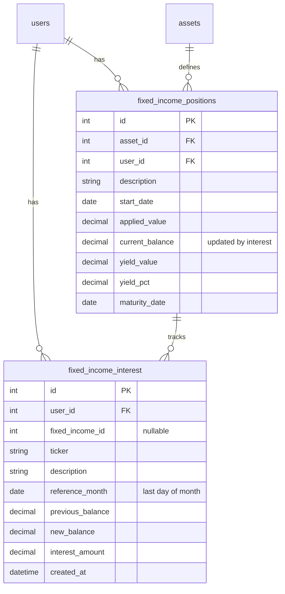

# feat: Add Interest Registration for Fixed Income Positions

## Overview

Add a system for tracking monthly interest (juros) on fixed income positions, creating a historical record of balance changes. Currently users manually edit `current_balance` inline with no history. This feature introduces a bulk "Registrar Juros" flow that records each monthly update, displays interest in the timeline alongside aportes and resgates, and integrates with the dashboard's monthly overview.

## Problem Statement / Motivation

Fixed income positions accrue interest monthly, but the system has no way to track these changes over time. Users edit `current_balance` directly, losing all history. This makes it impossible to:
- See how a position's balance evolved month over month
- Know when balances were last updated
- Include interest earned in monthly activity reports

## Proposed Solution

(see brainstorm: `docs/brainstorms/2026-03-19-renda-fixa-juros-brainstorm.md`)

1. **New `fixed_income_interest` DB table** to store interest entries with `previous_balance`, `new_balance`, and `interest_amount`
2. **Bulk registration flow** - a single "Registrar Juros" button opens a modal with a month picker and a table of all positions where the user enters new balances
3. **Timeline integration** - interest entries appear chronologically mixed with aportes and resgates, with a "JUROS" badge
4. **Dashboard integration** - interest amounts included in "Aportes do Mes" totals, with a separate RF tab in the detail drawer

## Technical Considerations

### Edge Cases Resolved

| Edge Case | Resolution |
|-----------|------------|
| Deleting non-most-recent interest entry | Only allow deleting the most recent entry per position (prevents balance chain breaks) |
| Negative interest (new_balance < current_balance) | Allow it - some instruments can lose value (mark-to-market). Display with negative indicator |
| Positions with maturity date in past | Show normally in the modal - they may still be active until redeemed |
| Zero change (new_balance = current_balance) | Skip - don't create entries with `interest_amount = 0` |
| Bulk atomicity | Atomic - entire batch in single DB transaction, any failure rolls back all |
| Position fully redeemed after interest registered | Set `fixed_income_id = NULL` on interest entries (same pattern as redemptions) |
| Overwrite month with existing entry | Show previously submitted `new_balance` in the input field for correction |
| Interest then partial redemption then delete interest | Blocked - cannot delete interest entry if subsequent redemptions exist for that position |

### Yield Recalculation

Same formula as existing inline edit (`backend/app/routers/fixed_income.py:109-112`):

```python
fi.yield_value = fi.current_balance - fi.applied_value
fi.yield_pct = fi.yield_value / fi.applied_value if fi.applied_value else 0
```

Interest changes `current_balance` only; `applied_value` stays the same.

### Chart

The "Evolucao Mensal" chart on the RF page stays as capital-only (no change this iteration). Interest is a growth metric, not capital invested.

## Acceptance Criteria

### Backend
- [x] New `FixedIncomeInterest` model in `backend/app/models/fixed_income_interest.py` with unique constraint on `(fixed_income_id, reference_month)`
- [x] Model registered in `backend/app/models/__init__.py`
- [x] New schemas in `backend/app/schemas/fixed_income.py`: `FixedIncomeInterestCreate`, `FixedIncomeInterestBulkCreate`, `FixedIncomeInterestResponse`
- [x] `POST /api/fixed-income/interest` endpoint - bulk upsert, updates position `current_balance`/`yield_value`/`yield_pct`
- [x] `GET /api/fixed-income/interest` endpoint - list all interest entries for user
- [x] `DELETE /api/fixed-income/interest/{id}` endpoint - only most recent entry per position, reverts balance
- [x] `fi_interest` field added to `MonthlyOverview` schema and populated in overview endpoint
- [x] Interest sum added to `aportes_do_mes` calculation in overview endpoint

### Frontend
- [x] `FixedIncomeInterest` type added to `frontend/src/types/index.ts`
- [x] `MonthlyOverview` type updated with `fi_interest` field
- [x] "Registrar Juros" button added to RF page header
- [x] Bulk interest modal with month/year picker and positions table
- [x] Timeline section renamed to "Aportes, Resgates & Juros" with "JUROS" badge
- [x] Interest entries in timeline with delete button (most recent only)
- [x] Detail drawer refactored with tabs: "Renda Variavel" | "Renda Fixa"
- [x] RF tab shows: Aportes RF, Resgates RF, Juros RF groups

## Implementation Plan

### Phase 1: Database & Backend

#### 1.1 New Model

**New file: `backend/app/models/fixed_income_interest.py`**

Follow the `FixedIncomeRedemption` pattern (`backend/app/models/fixed_income_redemption.py`):

```python
class FixedIncomeInterest(Base):
    __tablename__ = "fixed_income_interest"

    id: Mapped[int] = mapped_column(primary_key=True, autoincrement=True)
    user_id: Mapped[int] = mapped_column(Integer, ForeignKey("users.id"), nullable=False)
    fixed_income_id: Mapped[Optional[int]] = mapped_column(Integer, nullable=True)
    ticker: Mapped[str] = mapped_column(String(20), nullable=False)
    description: Mapped[str] = mapped_column(String(255), nullable=False, default="")
    reference_month: Mapped[date] = mapped_column(Date, nullable=False)  # last day of month
    previous_balance: Mapped[Decimal] = mapped_column(Numeric(18, 4), nullable=False)
    new_balance: Mapped[Decimal] = mapped_column(Numeric(18, 4), nullable=False)
    interest_amount: Mapped[Decimal] = mapped_column(Numeric(18, 4), nullable=False)
    created_at: Mapped[datetime] = mapped_column(DateTime, default=datetime.utcnow)

    __table_args__ = (
        UniqueConstraint("fixed_income_id", "reference_month", name="uq_fi_interest_position_month"),
    )
```

**Modify: `backend/app/models/__init__.py`** - Add import and `__all__` entry for `FixedIncomeInterest`.

#### 1.2 Schemas

**Modify: `backend/app/schemas/fixed_income.py`** - Add:

```python
class FixedIncomeInterestEntry(BaseModel):
    fixed_income_id: int
    new_balance: Decimal

class FixedIncomeInterestBulkCreate(BaseModel):
    reference_month: str  # "YYYY-MM" format
    entries: list[FixedIncomeInterestEntry]

class FixedIncomeInterestResponse(BaseModel):
    id: int
    fixed_income_id: int | None
    ticker: str
    description: str
    reference_month: date
    previous_balance: Decimal
    new_balance: Decimal
    interest_amount: Decimal
    created_at: datetime

    model_config = {"from_attributes": True}
```

#### 1.3 API Endpoints

**Modify: `backend/app/routers/fixed_income.py`** - Add 3 endpoints:

**`POST /interest`** (bulk upsert):
- Parse `reference_month` string to last day of month as `date`
- For each entry: fetch position, validate ownership, calculate `interest_amount = new_balance - current_balance`
- Skip entries where `interest_amount == 0`
- Upsert: if existing entry for `(fixed_income_id, reference_month)`, update `previous_balance`, `new_balance`, `interest_amount`
- Side effect: update position's `current_balance`, recalculate `yield_value` and `yield_pct`
- Wrap everything in a single transaction (atomic)
- Return list of created/updated `FixedIncomeInterestResponse`

**`GET /interest`**:
- Query all `FixedIncomeInterest` for user, ordered by `reference_month DESC, id DESC`
- Return `list[FixedIncomeInterestResponse]`

**`DELETE /interest/{interest_id}`**:
- Find entry, validate ownership
- Check it's the most recent entry for that position (query by `fixed_income_id` ordered by `reference_month DESC`, verify it's the first)
- Check no redemptions exist after this interest's `reference_month` for the same position
- If valid: revert position's `current_balance` to `previous_balance`, recalculate yields, delete entry
- If position was deleted (`fixed_income_id IS NULL`): just delete the entry (no balance to revert)
- Return 204

#### 1.4 Monthly Overview Integration

**Modify: `backend/app/schemas/portfolio.py`** - Add `fi_interest: list[FixedIncomeTransactionItem]` to `MonthlyOverview`.

**Modify: `backend/app/routers/portfolio.py`** (around lines 131-166, 262-334):
- Query `FixedIncomeInterest` entries for the month (where `reference_month` falls in the month range)
- Sum `interest_amount` and add to `aportes_do_mes`
- Build `fi_interest_list` using `FixedIncomeTransactionItem` schema
- Include in `MonthlyOverview` response

### Phase 2: Frontend

#### 2.1 Types

**Modify: `frontend/src/types/index.ts`**:

```typescript
export interface FixedIncomeInterest {
  id: number;
  fixed_income_id: number | null;
  ticker: string;
  description: string;
  reference_month: string;
  previous_balance: number;
  new_balance: number;
  interest_amount: number;
  created_at: string;
}
```

Add `fi_interest: FixedIncomeTransactionItem[]` to `MonthlyOverview`.

#### 2.2 Renda Fixa Page

**Modify: `frontend/src/app/carteira/renda-fixa/page.tsx`**:

**State additions:**
- `interest` state: `FixedIncomeInterest[]`
- `jurosOpen` state for modal
- `jurosMonth` state (default: current month as "YYYY-MM")
- `jurosBalances` state: `Record<number, string>` mapping position ID to new balance input
- `jurosSubmitting` state

**Data fetching:** Add `apiFetch<FixedIncomeInterest[]>("/fixed-income/interest")` to `fetchPositions`.

**"Registrar Juros" button:** Add between existing Aporte and Resgate buttons, with amber/yellow color (`bg-amber-600`).

**Bulk modal:**
- Month/year picker (HTML `<input type="month">` gives `YYYY-MM` format natively)
- Table: Ticker | Descricao | Saldo Atual | Novo Saldo (input)
- For months with existing entries: pre-fill "Novo Saldo" with the previously submitted `new_balance`
- Submit: POST with only entries where novo saldo differs from current balance
- On success: close modal, refresh data

**Timeline update:**
- Extend `TimelineEvent` type: `"APORTE" | "RESGATE" | "JUROS"`
- Add interest entries to timeline `useMemo` (use `reference_month` as date)
- Badge styling: amber/yellow for JUROS (`bg-amber-500/15 text-amber-500`)
- Delete button: only on most recent entry per position
- Amount display: always positive with `+` prefix

#### 2.3 Detail Drawer Tabs

**Modify: `frontend/src/components/detail-drawer.tsx`**:

- Add tab state: `"rv" | "rf"` (default: "rv")
- Tab bar at top of drawer: "Renda Variavel" | "Renda Fixa"
- **RV tab:** existing `buildAportesGroups`/`buildResgatesGroups` logic but filtering out RF and RESERVA groups... actually keep RESERVA in RV since it's not RF
- **RF tab for aportes:** Show 3 groups: "Aportes RF" (from `fi_aportes`), "Juros RF" (from `fi_interest`), subtotals per group
- **RF tab for resgates:** Show "Resgates RF" (from `fi_redemptions`)
- Grand total stays at the bottom, calculated from visible tab's groups

## ERD



## Dependencies & Risks

- **No Alembic migrations exist:** The project uses `Base.metadata.create_all` for schema creation. The new model will be auto-created on startup. If migrating to Alembic later, this table will need a migration.
- **Inline edit still available:** Users can still edit `current_balance` directly via inline edit. This bypasses interest history. Consider: should inline edit of `current_balance` be removed or kept as a "quick fix" escape hatch?
- **Snapshot service:** Currently uses `applied_value - redeemed` for RF in snapshots (`backend/app/services/snapshot_service.py:127`). Interest is not reflected in snapshots. This is a known gap but out of scope for this feature.

## Sources & References

- **Origin brainstorm:** [docs/brainstorms/2026-03-19-renda-fixa-juros-brainstorm.md](docs/brainstorms/2026-03-19-renda-fixa-juros-brainstorm.md) - Key decisions: bulk registration, new balance input, reference month, upsert, new table, include in aportes, separate RF tab
- **Redemption model pattern:** `backend/app/models/fixed_income_redemption.py` - identical pattern for denormalized fields and nullable FK
- **Redemption router pattern:** `backend/app/routers/fixed_income.py:119-166` - template for interest endpoints (create record + mutate position)
- **Overview endpoint:** `backend/app/routers/portfolio.py:89-334` - where `fi_interest` needs to be added
- **Detail drawer:** `frontend/src/components/detail-drawer.tsx` - needs tab refactoring
- **RF page:** `frontend/src/app/carteira/renda-fixa/page.tsx` - main page to modify
