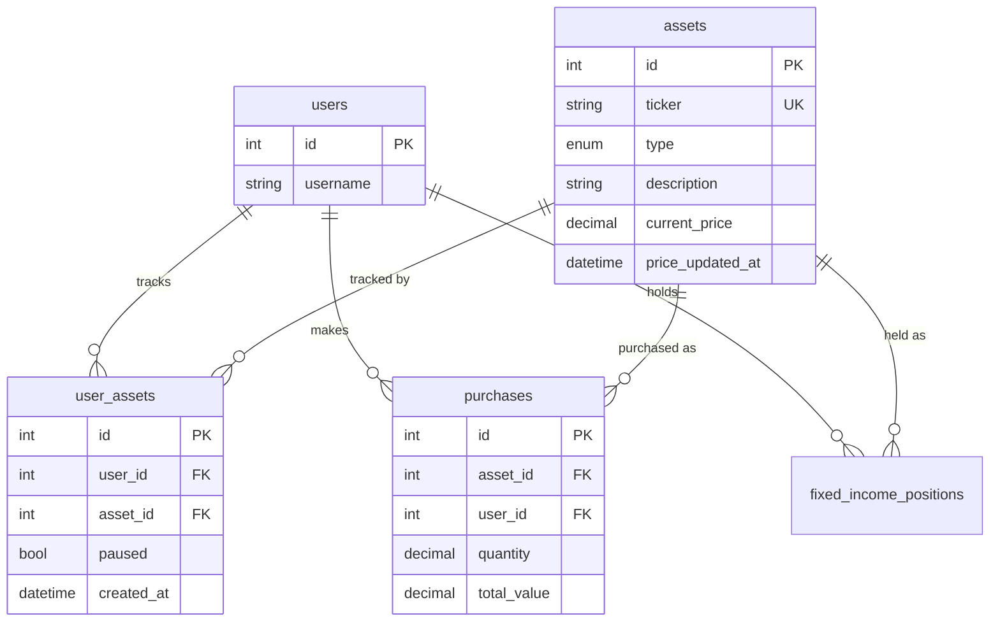

# feat: User-Scoped Asset Catalog + Asset Deletion

## Overview

Atualmente todos os usuarios compartilham o mesmo catalogo de ativos. Este plano adiciona uma tabela `user_assets` que vincula usuarios aos ativos que rastreiam, e um endpoint de exclusao que remove o vinculo (desde que a posicao esteja zerada). O campo `paused` migra de `assets` para `user_assets` (per-user).

(see brainstorm: docs/brainstorms/2026-03-23-user-scoped-assets-brainstorm.md)

## Problem Statement / Motivation

1. **Catalogo compartilhado:** Quando um usuario adiciona um ativo, todos os outros usuarios o veem. Isso quebra o isolamento multi-usuario.
2. **Sem exclusao:** Nao ha como remover ativos indesejados do catalogo. O campo `paused` existe mas o ativo permanece visivel.
3. **Rebalanceamento global:** O servico de rebalanceamento usa todos os ativos nao-pausados globalmente, incluindo ativos de outros usuarios (bug existente).

## Proposed Solution

### Nova tabela `user_assets` (join table)

```
user_assets
├── id (PK, autoincrement)
├── user_id (FK -> users.id, NOT NULL, INDEX)
├── asset_id (FK -> assets.id, NOT NULL, INDEX)
├── paused (BOOLEAN, default false)
├── created_at (DATETIME)
└── UNIQUE(user_id, asset_id)
```



### Alteracao na tabela `assets`

- Remover coluna `paused` (migra para `user_assets`)

### Comportamento dos Endpoints

| Cenario (POST /assets) | Ativo global existe? | Link user_assets existe? | Resultado |
|-------------------------|---------------------|--------------------------|-----------|
| Ticker novo | Nao | Nao | Cria global + cria link → 201 |
| Ticker existe, user nao tem | Sim | Nao | Cria link → 201 |
| Ticker existe, user ja tem | Sim | Sim | Retorna 409 "Voce ja rastreia este ativo" |

| Endpoint | Mudanca |
|----------|---------|
| `GET /assets` | JOIN user_assets, filtrar por user_id. Retorna paused de user_assets |
| `POST /assets` | Cria global (se nao existe) + cria link user_assets. Nao retorna 409 para ticker existente se o user nao tem link |
| `POST /assets/bulk` | Para cada ticker: cria global se nao existe + cria link. Response: `created` (novo global+link), `linked` (global existia, link criado), `skipped` (link ja existia) |
| `GET /assets/{id}` | Verificar se user tem link user_assets. 404 se nao tem |
| `PUT /assets/{id}` | Separar: `paused` → atualiza user_assets. `ticker`/`description` → atualiza assets global |
| `DELETE /assets/{id}` (NOVO) | Verificar posicao = 0, remover link user_assets. Retorna 409 se posicao > 0 |
| `POST /purchases` | Validar que user_assets link existe antes de permitir compra |
| Servico de precos | Sem mudanca (global) |
| Rebalanceamento | Filtrar por user_assets + ler paused de user_assets |

## Technical Considerations

### Position Check para Exclusao

Para ativos variaveis (STOCK, ACAO, FII):
```sql
SELECT COALESCE(SUM(quantity), 0) FROM purchases
WHERE user_id = ? AND asset_id = ?
```
Posicao = 0 → permite exclusao.

Para RF:
```sql
SELECT COUNT(*) FROM fixed_income_positions
WHERE user_id = ? AND asset_id = ?
```
Count = 0 → permite exclusao. Se tem posicoes RF, nao permite (usuario deve remover posicoes RF antes).

### Concorrencia

- `POST /assets`: Usar try/except `IntegrityError` no INSERT do ativo global (race condition se dois usuarios criam mesmo ticker simultaneamente). Se IntegrityError na criacao global, buscar o existente e criar apenas o link.
- `DELETE /assets/{id}`: Usar SELECT FOR UPDATE no check de posicao para evitar race condition entre check e delete.

### Compras Apos Exclusao

Compras historicas **permanecem** no banco. Endpoints de portfolio (overview, positions) derivam de purchases com `user_id` — continuam funcionando normalmente. O ativo simplesmente nao aparece mais no catalogo nem no rebalanceamento.

### Migracao de Dados

1. Criar tabela `user_assets`
2. Popular com `SELECT DISTINCT user_id, asset_id FROM purchases UNION SELECT DISTINCT user_id, asset_id FROM fixed_income_positions`
3. Copiar `paused` da tabela global: `UPDATE user_assets ua JOIN assets a ON ua.asset_id = a.id SET ua.paused = a.paused`
4. Para ativos orfaos (sem compras de nenhum usuario): se ha apenas 1 usuario no sistema, vincular todos ao unico usuario. Se ha multiplos, deixar orfaos (serao invisiveis — usuario pode re-adicionar).
5. Remover coluna `paused` de `assets`

## Acceptance Criteria

- [x] Nova tabela `user_assets` criada com UNIQUE(user_id, asset_id)
- [x] `GET /assets` retorna apenas ativos vinculados ao usuario autenticado
- [x] `POST /assets` cria ativo global + link, ou apenas link se global ja existe
- [x] `POST /assets/bulk` cria globals + links, com response distinguindo created/linked/skipped
- [x] `PUT /assets/{id}` atualiza `paused` em `user_assets`
- [x] `DELETE /assets/{id}` remove link se posicao = 0, retorna 409 se posicao > 0
- [x] `POST /purchases` valida existencia de link `user_assets`
- [x] Servico de rebalanceamento filtra por `user_assets` do usuario (fix do bug global)
- [x] Migracao Alembic cria tabela, popula dados, remove `paused` de `assets`
- [x] Frontend catalogo mostra botao de excluir com confirmacao
- [x] Frontend catalogo reflete paused per-user
- [x] Campo `paused` removido da tabela `assets`

## Implementation Plan

### Fase 1: Backend — Model + Migration

**Arquivos:**
- `backend/app/models/user_asset.py` (NOVO)
- `backend/app/models/__init__.py` (adicionar import)
- `backend/app/models/asset.py` (remover campo paused)
- `backend/alembic/versions/004_add_user_assets.py` (NOVO)

**Tarefas:**
1. Criar model `UserAsset` em `backend/app/models/user_asset.py`:
   ```python
   class UserAsset(Base):
       __tablename__ = "user_assets"
       id: Mapped[int] = mapped_column(primary_key=True, autoincrement=True)
       user_id: Mapped[int] = mapped_column(Integer, ForeignKey("users.id"), nullable=False, index=True)
       asset_id: Mapped[int] = mapped_column(Integer, ForeignKey("assets.id"), nullable=False, index=True)
       paused: Mapped[bool] = mapped_column(default=False)
       created_at: Mapped[datetime] = mapped_column(DateTime, default=lambda: datetime.now(timezone.utc))
       __table_args__ = (UniqueConstraint("user_id", "asset_id"),)
       asset = relationship("Asset", lazy="joined")
   ```
2. Registrar em `__init__.py`
3. Criar migracao Alembic `004_add_user_assets`:
   - `upgrade()`: criar tabela, popular de purchases+fixed_income_positions, copiar paused, drop paused de assets
   - `downgrade()`: adicionar paused de volta, copiar de user_assets, drop tabela user_assets

### Fase 2: Backend — Schemas

**Arquivos:**
- `backend/app/schemas/asset.py` (atualizar)

**Tarefas:**
1. `AssetResponse`: remover `paused` dos campos do model e injetar de `user_assets` na query (campo continua no response, fonte muda)
2. `AssetUpdate`: manter `paused` no schema (sera roteado para user_assets no endpoint)
3. `BulkAssetResponse`: adicionar campo `linked: list[BulkAssetLinked]` com items que foram apenas vinculados (nao criados)

### Fase 3: Backend — Endpoints

**Arquivos:**
- `backend/app/routers/assets.py` (reescrever maioria dos endpoints)
- `backend/app/routers/purchases.py` (adicionar validacao de link)

**Tarefas:**
1. `GET /assets`: JOIN com user_assets, filtrar por user.id, SELECT paused de user_assets
2. `POST /assets`: try criar global (catch IntegrityError → buscar existente), criar link user_assets
3. `POST /assets/bulk`: mesma logica em batch, response com created/linked/skipped
4. `GET /assets/{id}`: JOIN user_assets, 404 se nao tem link
5. `PUT /assets/{id}`: se `paused` presente → update user_assets; se `ticker`/`description` → update assets global
6. `DELETE /assets/{id}` (novo):
   - Verificar link user_assets existe (404 se nao)
   - Check posicao: para STOCK/ACAO/FII → sum(quantity) from purchases; para RF → count from fixed_income_positions
   - Se posicao > 0 → 409 com mensagem indicando posicao atual
   - Se posicao = 0 → delete user_assets row → 204
7. `POST /purchases`: adicionar check de user_assets link antes de criar compra

### Fase 4: Backend — Servicos

**Arquivos:**
- `backend/app/services/rebalancing_service.py` (fix bug global)

**Tarefas:**
1. `_get_assets_with_values()`: mudar query para JOIN user_assets, filtrar por user_id, ler paused de user_assets (nao de assets)
2. Passar `user_id` para o metodo (atualmente nao recebe)

### Fase 5: Frontend — Tipos e Catalogo

**Arquivos:**
- `frontend/src/types/index.ts` (adicionar tipo BulkAssetLinked se necessario)
- `frontend/src/app/carteira/catalogo/page.tsx` (adicionar botao delete)
- `frontend/src/components/csv-import-modal.tsx` (atualizar response handling)

**Tarefas:**
1. Adicionar botao de delete no catalogo (icone Trash2 ao lado do pause toggle)
2. Modal de confirmacao: "Remover {ticker} do seu catalogo?"
3. Se 409 (posicao > 0): mostrar toast de erro com mensagem do backend
4. Se 204: remover asset da lista local, toast de sucesso
5. CSV import: mostrar categoria "linked" no resultado alem de created/skipped

## Dependencies & Risks

**Dependencias:**
- Migracao deve rodar antes de qualquer mudanca nos endpoints
- Backend deve estar pronto antes das mudancas de frontend

**Riscos:**
- Migracao com dados existentes: testar em dev antes de deploy
- Ativos orfaos (sem compras): decisao pragmatica de vincular ao unico usuario se houver apenas 1
- Race condition no POST /assets: mitigado com IntegrityError handling

## Sources & References

- **Origin brainstorm:** [docs/brainstorms/2026-03-23-user-scoped-assets-brainstorm.md](docs/brainstorms/2026-03-23-user-scoped-assets-brainstorm.md) — catalogo global + user_assets, paused per-user, delete como desvinculacao
- Asset model: `backend/app/models/asset.py`
- Purchase model: `backend/app/models/purchase.py`
- Asset router: `backend/app/routers/assets.py`
- Rebalancing service: `backend/app/services/rebalancing_service.py:198` (bug: query global)
- Frontend catalog: `frontend/src/app/carteira/catalogo/page.tsx`
- Frontend types: `frontend/src/types/index.ts`
- Existing migrations: `backend/alembic/versions/003_add_asset_paused.py` (last migration)
