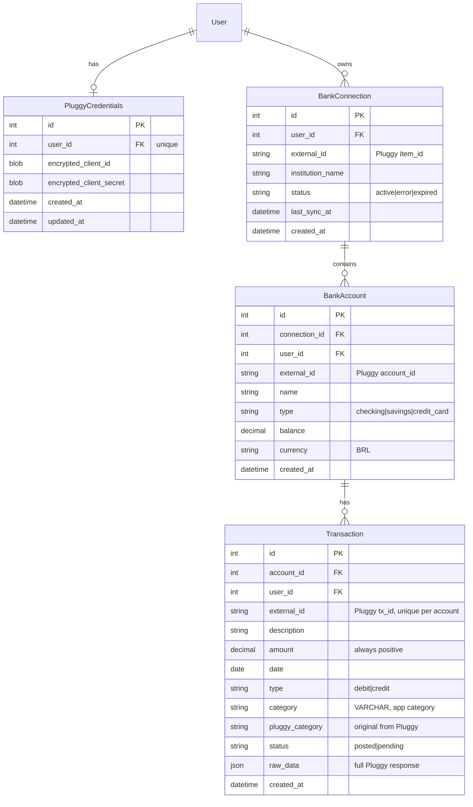

# feat: Add Despesas (Expenses) Section with Pluggy Bank Integration

## Overview

Add a new "Despesas" section to Cofrinho Gordinho that connects to Brazilian banks via Pluggy Open Finance API to import and display user transactions. Each user provides their own Pluggy credentials (client_id/secret), connects their banks through the Pluggy widget, and views categorized expenses with monthly totals.

**Scope:** MVP — manual sync only, fixed categories, no auto-sync/Celery, no fuzzy merge, no transfer detection.

## Problem Statement / Motivation

The app currently tracks investments but has no visibility into expenses. Users want to see where their money goes alongside their portfolio. Pluggy provides Open Finance access to Brazilian banks, and the user already has a working reference implementation in the `~/securo` repository.

## Proposed Solution

Widget-based bank connection flow with pull-based transaction sync, adapted from the securo codebase. Key architectural difference: **per-user Pluggy credentials** (not app-wide), stored encrypted in the database.

### High-Level Flow

```
1. User configures Pluggy credentials (client_id + secret) → encrypted in DB
2. User clicks "Conectar Banco" → backend creates connect token using user's credentials
3. Pluggy widget opens → user authenticates with bank
4. Widget returns item_id → frontend sends to backend
5. Backend fetches accounts + transactions from Pluggy API → stores in DB
6. User views transactions on /carteira/despesas with category filters + monthly totals
7. User clicks "Sincronizar" → backend fetches new transactions incrementally
```

## Technical Approach

### Architecture

```
┌─────────────────────────────────────────────────────────────────┐
│ Frontend (Next.js 15)                                           │
│                                                                 │
│  /carteira/despesas                                             │
│  ┌─────────────────┐  ┌──────────────┐  ┌───────────────────┐  │
│  │ Credentials     │  │ Bank Connect │  │ Transaction List  │  │
│  │ Config Dialog   │  │ Dialog       │  │ + Category Totals │  │
│  │ (client_id/sec) │  │ (Pluggy wdgt)│  │ + Month Filter    │  │
│  └────────┬────────┘  └──────┬───────┘  └────────┬──────────┘  │
│           │                  │                    │              │
└───────────┼──────────────────┼────────────────────┼──────────────┘
            │ POST /api/       │ POST /api/         │ GET /api/
            │ pluggy-creds     │ connections/*      │ transactions
┌───────────┼──────────────────┼────────────────────┼──────────────┐
│ Backend (FastAPI)            │                    │              │
│           │                  │                    │              │
│  ┌────────▼────────┐  ┌─────▼──────┐  ┌─────────▼───────────┐  │
│  │ PluggyCredential│  │ Connection │  │ Transaction Router  │  │
│  │ Router          │  │ Router     │  │ (list + filters)    │  │
│  └────────┬────────┘  └─────┬──────┘  └─────────┬───────────┘  │
│           │                  │                    │              │
│  ┌────────▼──────────────────▼────────────────────▼───────────┐  │
│  │ Pluggy Service (auth, connect_token, fetch transactions)  │  │
│  └─────────────────────────┬─────────────────────────────────┘  │
│                            │ httpx                               │
└────────────────────────────┼────────────────────────────────────┘
                             │
                    ┌────────▼────────┐
                    │ Pluggy API      │
                    │ api.pluggy.ai   │
                    └─────────────────┘
```

### Data Model (ERD)



### Implementation Phases

#### Phase 1: Backend Foundation (Models, Migration, Encryption)

**New files:**
- `backend/app/models/pluggy_credentials.py` — PluggyCredentials model
- `backend/app/models/bank_connection.py` — BankConnection model
- `backend/app/models/bank_account.py` — BankAccount model
- `backend/app/models/transaction.py` — Transaction model
- `backend/app/schemas/expenses.py` — All Pydantic schemas for the feature
- `backend/app/services/encryption_service.py` — Fernet encrypt/decrypt for credentials
- `backend/alembic/versions/005_add_expenses_tables.py` — Single migration for all 4 tables

**Files to modify:**
- `backend/app/models/__init__.py` — Register new models in `__all__`
- `backend/app/config.py` — Add `ENCRYPTION_KEY: str` setting
- `.env.example` — Document `ENCRYPTION_KEY`

**Key decisions:**
- **Credential encryption:** Use `cryptography.fernet` with `ENCRYPTION_KEY` from `.env`. This is the only new env var needed (no app-wide Pluggy keys). (see brainstorm: per-user credentials)
- **Amount convention:** Always positive, `type` field indicates direction (debit/credit). Matches securo pattern.
- **Category storage:** VARCHAR column (not MySQL ENUM) to avoid ALTER TABLE for new categories. Python-side validation via string literal type.
- **Deduplication:** Unique constraint on `(account_id, external_id)` — skip on conflict during sync.
- **Cascade deletes:** BankConnection → BankAccount → Transaction, all CASCADE.
- **Indexes:** `(user_id, date)` on Transaction for the primary query path; `(account_id, external_id)` unique for dedup.

**Category enum (Python-side):**
```python
EXPENSE_CATEGORIES = [
    "Alimentação", "Mercado", "Transporte", "Moradia", "Saúde",
    "Lazer", "Assinaturas", "Educação", "Vestuário", "Transferências",
    "Investimentos", "Outros"
]

PLUGGY_CATEGORY_MAP = {
    "Eating out": "Alimentação",
    "Restaurants": "Alimentação",
    "Groceries": "Mercado",
    "Pharmacy": "Saúde",
    "Taxi and ride-hailing": "Transporte",
    "Transport": "Transporte",
    "Housing": "Moradia",
    "Rent": "Moradia",
    "Utilities": "Moradia",
    "Entertainment": "Lazer",
    "Subscriptions": "Assinaturas",
    "Transfer": "Transferências",
    "Education": "Educação",
    # ... adapt from securo's connection_service.py
}
```

#### Phase 2: Backend API (Pluggy Service + Routers)

**New files:**
- `backend/app/services/pluggy_service.py` — All Pluggy API communication (adapted from `~/securo/backend/app/providers/pluggy.py`)
- `backend/app/routers/pluggy_credentials.py` — CRUD for user's Pluggy credentials
- `backend/app/routers/connections.py` — Connection lifecycle (connect-token, callback, sync, delete)
- `backend/app/routers/transactions.py` — Transaction listing with filters

**Files to modify:**
- `backend/app/main.py` — Register 3 new routers
- `backend/requirements.txt` — Add `cryptography` (httpx already present)

**Endpoints:**

| Method | Endpoint | Purpose |
|--------|----------|---------|
| GET | `/api/pluggy-credentials` | Check if user has configured credentials (returns boolean, never exposes secrets) |
| POST | `/api/pluggy-credentials` | Save/update encrypted Pluggy client_id + secret |
| DELETE | `/api/pluggy-credentials` | Remove user's Pluggy credentials |
| POST | `/api/connections/connect-token` | Create Pluggy widget connect token (uses user's credentials) |
| POST | `/api/connections/callback` | Handle widget success (item_id) → fetch accounts + initial transactions |
| GET | `/api/connections` | List user's bank connections (status, institution, last_sync) |
| POST | `/api/connections/{id}/sync` | Manual sync — fetch new transactions since last_sync_at |
| POST | `/api/connections/{id}/reconnect-token` | Get widget token for re-auth of expired connection |
| DELETE | `/api/connections/{id}` | Delete connection + cascade accounts/transactions |
| GET | `/api/transactions` | List transactions with filters (month, category, account_id) |
| GET | `/api/transactions/summary` | Category totals for a given month |

**Pluggy Service design (adapted from securo):**
- `authenticate(client_id, client_secret)` → API key (cached in memory per user, 2h TTL minus 60s buffer)
- `create_connect_token(api_key, item_id=None)` → connect token for widget
- `get_item(api_key, item_id)` → connection details + status
- `get_accounts(api_key, item_id)` → list of accounts
- `get_transactions(api_key, account_id, from_date=None)` → paginated transaction fetch (500/page)
- All calls via `httpx.AsyncClient` with **30s timeout** for sync, **10s** for other calls

**Sync logic:**
1. Decrypt user's Pluggy credentials
2. Authenticate with Pluggy API → get/refresh API key
3. Check item status via `GET /items/{item_id}` — if expired/error, update connection status and return error
4. For each account: fetch transactions since `last_sync_at` (or all if first sync)
5. Map Pluggy categories → app categories via `PLUGGY_CATEGORY_MAP`
6. Insert new transactions (skip if `external_id` already exists — unique constraint handles dedup)
7. Update `last_sync_at` on connection
8. Return sync summary: `{ new_transactions: int, connection_status: str }`

**Security measures:**
- All endpoints require `Depends(get_current_user)`
- Callback validates that user has configured Pluggy credentials before processing
- Rate limit on sync: reuse existing `@limiter.limit` pattern, `3/minute` per user
- Pluggy credentials never returned in API responses (only `has_credentials: bool`)
- `raw_data` JSON field stores full Pluggy response for debugging (contains no bank login credentials — Pluggy handles that in their widget)

#### Phase 3: Frontend — Despesas Page

**New files:**
- `frontend/src/app/carteira/despesas/page.tsx` — Main page
- `frontend/src/components/pluggy-credentials-dialog.tsx` — Dialog to configure Pluggy client_id/secret
- `frontend/src/components/bank-connect-dialog.tsx` — Wrapper for `react-pluggy-connect` widget

**Files to modify:**
- `frontend/src/components/sidebar.tsx` — Add "Despesas" to `navItems` (after "Mensal", before "Ativos" group)
- `frontend/src/types/index.ts` — Add new TypeScript interfaces
- `frontend/package.json` — Add `react-pluggy-connect` dependency

**New TypeScript types:**
```typescript
interface BankConnection {
  id: number;
  institution_name: string;
  status: "active" | "error" | "expired";
  last_sync_at: string | null;
  created_at: string;
}

interface BankAccount {
  id: number;
  connection_id: number;
  name: string;
  type: "checking" | "savings" | "credit_card";
  balance: number;
  currency: string;
}

interface Transaction {
  id: number;
  account_id: number;
  description: string;
  amount: number;
  date: string;
  type: "debit" | "credit";
  category: string;
  status: "posted" | "pending";
}

interface TransactionSummary {
  category: string;
  total: number;
  count: number;
}
```

**Page layout (3 states):**

**State 1: No Pluggy credentials configured**
```
┌─────────────────────────────────────────────┐
│ Despesas                                    │
│                                             │
│  ┌───────────────────────────────────────┐  │
│  │  Configure suas credenciais Pluggy    │  │
│  │  para conectar seus bancos            │  │
│  │                                       │  │
│  │  [Configurar Pluggy]                  │  │
│  └───────────────────────────────────────┘  │
└─────────────────────────────────────────────┘
```

**State 2: Credentials configured, no connections**
```
┌─────────────────────────────────────────────┐
│ Despesas                     [⚙ Pluggy]     │
│                                             │
│  ┌───────────────────────────────────────┐  │
│  │  Conecte um banco para ver suas       │  │
│  │  despesas automaticamente             │  │
│  │                                       │  │
│  │  [Conectar Banco]                     │  │
│  └───────────────────────────────────────┘  │
└─────────────────────────────────────────────┘
```

**State 3: Connected, viewing transactions**
```
┌───────────────────────────────────────────────────────┐
│ Despesas                     [⚙ Pluggy] [+ Banco]    │
│                                                       │
│ ◄ Fev 2026    Mar 2026    Abr 2026 ►                 │
│                                                       │
│ ┌──────────┐ ┌──────────┐ ┌──────────┐ ┌──────────┐  │
│ │Alimentação│ │Transporte│ │ Moradia  │ │  Total   │  │
│ │ R$ 1.250 │ │ R$ 450   │ │ R$ 2.100 │ │ R$ 5.800 │  │
│ └──────────┘ └──────────┘ └──────────┘ └──────────┘  │
│                                                       │
│ Conexões: Nubank ✓ última sync 2h atrás [Sync]       │
│           BB ⚠ expirado [Reconectar]                  │
│                                                       │
│ Filtrar: [Todas categorias ▼]                         │
│                                                       │
│ ┌─────────────────────────────────────────────────┐   │
│ │ 24/03  NETFLIX           Assinaturas  -R$ 55,90│   │
│ │ 23/03  SUPERMERCADO BH   Mercado     -R$ 342,15│   │
│ │ 23/03  UBER              Transporte   -R$ 28,40│   │
│ │ 22/03  PIX RECEBIDO      Transferência+R$ 500  │   │
│ │ ...                                             │   │
│ └─────────────────────────────────────────────────┘   │
└───────────────────────────────────────────────────────┘
```

**Mobile:** Same layout but transaction list uses `MobileCard` component, category totals scroll horizontally, connection status is collapsible.

**Key UX decisions:**
- Show **both debit and credit** transactions (credits in green, debits in red/default)
- Category totals show **debit-only** sum (expenses)
- Month navigation follows existing Mensal page pattern
- Category filter is **single-select dropdown** with "Todas" default
- Sync button shows spinner + disables during sync, toast on completion
- Widget opens in a dialog (test on mobile — fallback to full-page if needed)

## System-Wide Impact

- **New dependency:** `cryptography` (backend), `react-pluggy-connect` (frontend)
- **New env var:** `ENCRYPTION_KEY` — required for Pluggy credential encryption. Must be set in `.env` (dev) and GitHub Secrets + VPS `.env` (prod)
- **Database:** 4 new tables, 1 migration (005)
- **Sidebar:** 1 new nav item — auto-propagates to mobile drawer via shared `navItems`
- **No impact** on existing investment features — fully isolated models/routes
- **Next.js rewrites:** No changes needed — `/api/*` already proxied to backend

## Acceptance Criteria

### Functional
- [ ] User can save/update/delete their Pluggy credentials (encrypted at rest)
- [ ] User can connect a bank via Pluggy widget
- [ ] User can view transactions grouped by month with category totals
- [ ] User can filter transactions by category
- [ ] User can manually sync to fetch new transactions
- [ ] User can see connection status (active/error/expired) and reconnect
- [ ] User can delete a connection (cascades accounts + transactions)
- [ ] User can connect multiple banks and see aggregated transactions
- [ ] Deduplication prevents duplicate transactions on re-sync
- [ ] Pluggy categories are mapped to app categories

### Non-Functional
- [ ] Pluggy credentials are encrypted with Fernet before DB storage
- [ ] Pluggy credentials are never returned in API responses
- [ ] All endpoints require JWT authentication
- [ ] Sync endpoint is rate-limited (3/min per user)
- [ ] Transaction queries use indexed `(user_id, date)` for performance
- [ ] httpx calls have explicit timeouts (10s general, 30s sync)
- [ ] Page is responsive (desktop table + mobile cards)

### Security
- [ ] `ENCRYPTION_KEY` is in `.env` (gitignored), not in code
- [ ] No Pluggy secrets in frontend code or API responses
- [ ] Bank login credentials never touch our system (handled by Pluggy widget)
- [ ] Callback endpoint validates user has configured credentials

## Dependencies & Risks

| Risk | Mitigation |
|------|------------|
| Pluggy API down during sync | Timeout + error toast, connection stays in current state |
| Connect token expires (30 min) during auth | Generate fresh token each time widget opens |
| Bank connection expires (90 days Open Finance) | Detect on sync attempt via item status, show "Reconectar" |
| Widget doesn't work on mobile Safari | Test early; fallback is desktop-only for MVP |
| MySQL JSON column perf for raw_data | raw_data is write-only for debugging, never queried |
| `cryptography` package adds ~5MB to Docker image | Acceptable tradeoff for credential security |

## File Inventory

### New Files (Backend)
| File | Purpose |
|------|---------|
| `backend/app/models/pluggy_credentials.py` | PluggyCredentials model |
| `backend/app/models/bank_connection.py` | BankConnection model |
| `backend/app/models/bank_account.py` | BankAccount model |
| `backend/app/models/transaction.py` | Transaction model |
| `backend/app/schemas/expenses.py` | All Pydantic schemas |
| `backend/app/services/pluggy_service.py` | Pluggy API client (httpx) |
| `backend/app/services/encryption_service.py` | Fernet encrypt/decrypt |
| `backend/app/routers/pluggy_credentials.py` | Credentials CRUD |
| `backend/app/routers/connections.py` | Connection lifecycle |
| `backend/app/routers/transactions.py` | Transaction listing |
| `backend/alembic/versions/005_add_expenses_tables.py` | Migration |

### New Files (Frontend)
| File | Purpose |
|------|---------|
| `frontend/src/app/carteira/despesas/page.tsx` | Main page |
| `frontend/src/components/pluggy-credentials-dialog.tsx` | Credentials config dialog |
| `frontend/src/components/bank-connect-dialog.tsx` | Pluggy widget wrapper |

### Modified Files
| File | Change |
|------|--------|
| `backend/app/models/__init__.py` | Register 4 new models |
| `backend/app/main.py` | Register 3 new routers |
| `backend/app/config.py` | Add `ENCRYPTION_KEY` setting |
| `backend/requirements.txt` | Add `cryptography` |
| `frontend/src/components/sidebar.tsx` | Add "Despesas" nav item |
| `frontend/src/types/index.ts` | Add new interfaces |
| `frontend/package.json` | Add `react-pluggy-connect` |
| `.env.example` | Document `ENCRYPTION_KEY` |

## Sources & References

### Origin
- **Brainstorm:** [docs/brainstorms/2026-03-24-despesas-pluggy-brainstorm.md](docs/brainstorms/2026-03-24-despesas-pluggy-brainstorm.md) — Key decisions: MVP scope, manual sync only, fixed categories, top-level nav, per-user Pluggy credentials

### Internal References (securo repo)
- Pluggy provider: `~/securo/backend/app/providers/pluggy.py` — auth flow, transaction fetch, paginated API calls
- Connection service: `~/securo/backend/app/services/connection_service.py` — category mapping, sync logic, dedup
- API routes: `~/securo/backend/app/api/connections.py` — endpoint patterns
- Widget component: `~/securo/frontend/src/components/bank-connect-dialog.tsx` — react-pluggy-connect usage
- Models: `~/securo/backend/app/models/bank_connection.py`, `account.py`, `transaction.py`

### External References
- Pluggy API docs: https://docs.pluggy.ai
- react-pluggy-connect: https://github.com/pluggyai/react-pluggy-connect
- Pluggy API auth: `POST https://api.pluggy.ai/auth` (client credentials → 2h API key)
- Connect token: `POST https://api.pluggy.ai/connect_token` (30 min widget token)
- Transactions: `GET https://api.pluggy.ai/transactions?accountId=X&pageSize=500`
